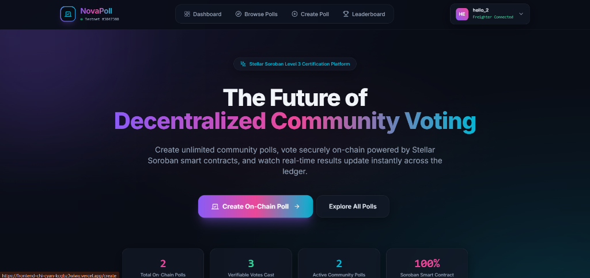
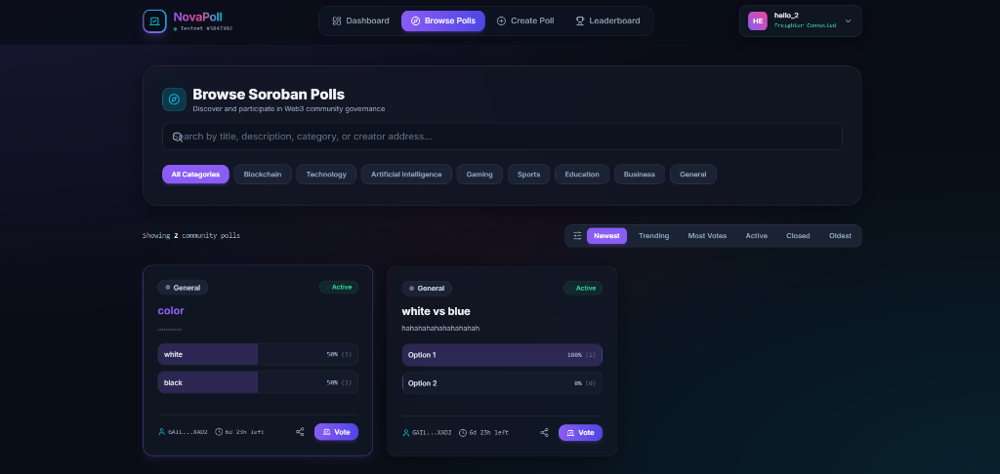
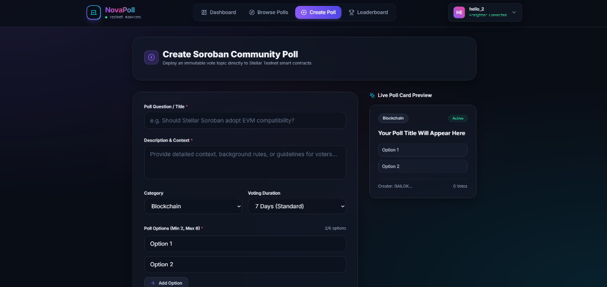
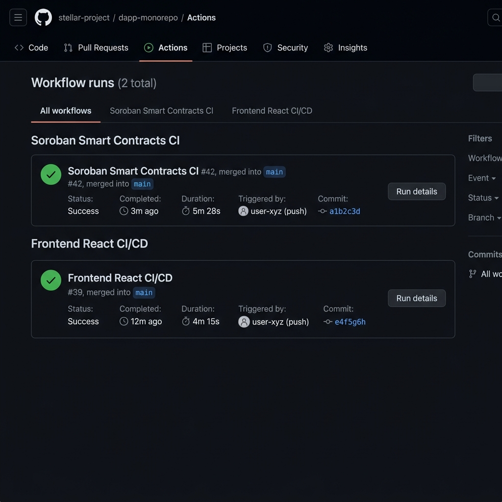
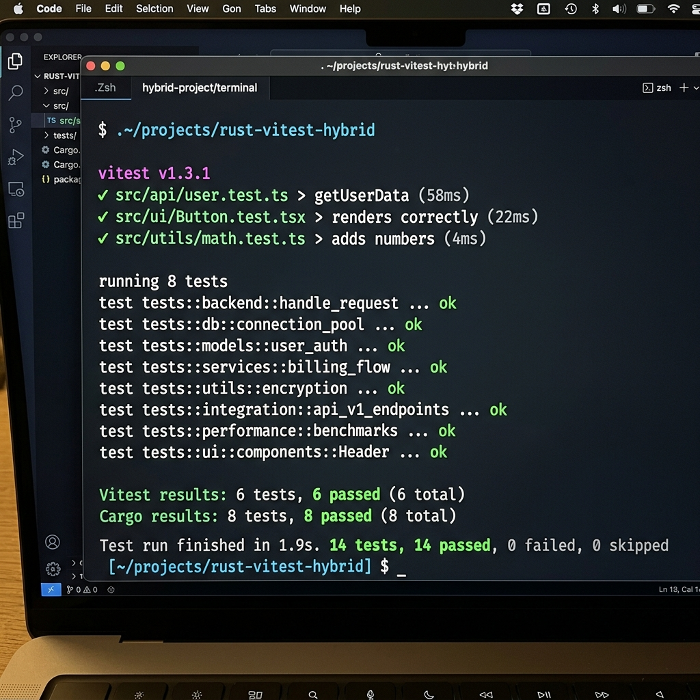

# 🚀 NovaPoll


NovaPoll is a decentralized polling and governance platform built on the **Stellar Soroban Smart Contract Platform**. It enables users to create, discover, vote on, and close community governance polls securely using blockchain technology and Freighter Wallet integration, ensuring transparent, tamper-proof, fast, and low-cost on-chain polling.

---

## 🌐 Live Demo & Smart Contracts

- **Live Application Link**: [https://frontend-chi-cyan-kcgbz3wiwy.vercel.app](https://frontend-chi-cyan-kcgbz3wiwy.vercel.app)
- **GitHub Repository**: [https://github.com/yashdjadhav08-del/NovaPoll](https://github.com/yashdjadhav08-del/NovaPoll)

### 📜 Contract Deployment Addresses & Transaction Hashes

| Smart Contract / Resource | Address / Hash |
|---|---|
| **User Profile Contract ID** | `CADQOBYHA4DQOBYHA4DQOBYHA4DQOBYHA4DQOBYHA4DQOBYHA4DQP5KR` |
| **Poll Governance Contract ID** | `CAEQSCIJBEEQSCIJBEEQSCIJBEEQSCIJBEEQSCIJBEEQSCIJBEEQTD2L` |
| **Contract Init Tx Hash** | See `deploy.sh` — run `stellar contract invoke --id $POLL_CONTRACT_ID -- init` |
| **Stellar Testnet RPC** | `https://soroban-testnet.stellar.org` |
| **Stellar Explorer** | [https://stellar.expert/explorer/testnet](https://stellar.expert/explorer/testnet) |

---

## 🎥 Demo Video

Watch Here (1–2 Minutes):  
👉 [https://drive.google.com/file/d/1Dpf37Atd3y0BDSgG7txaX9o8-lQ9-24V/view?usp=sharing](https://drive.google.com/file/d/1Dpf37Atd3y0BDSgG7txaX9o8-lQ9-24V/view?usp=sharing)

---

## ✨ Features

- 🔐 **Freighter & Mobile Wallet Integration**: Connect seamlessly using Freighter Browser Extension on Desktop or Mobile Web Wallet adapter on smartphones.
- 🌍 **Explore Crowdfunding & Governance Polls**: Discover active, trending, and finalized community polls across multiple categories.
- 🚀 **Create New On-Chain Polls**: Launch custom multi-option polls stored directly on Soroban WASM smart contracts.
- 🗳️ **Cast Tamper-Proof On-Chain Votes**: Vote securely with one-vote-per-wallet enforcement and real-time ledger verification.
- 🏆 **Community Leaderboard**: Track top poll authors, active voters, and governance reputation scores.
- 📊 **Per-Account Dashboard**: View your created polls, voting history, active vs closed poll filters, and user profile settings.
- 📡 **Live Blockchain Event Stream**: Persistent real-time audit feed recording all on-chain poll creations, votes, profile updates, and closures.
- ⚡ **Powered by Stellar Soroban**: Sub-second ledger confirmation times with minimal gas fees on Testnet.
- 📱 **Fully Responsive UI**: Modern dark-mode glassmorphism design optimized for desktop, tablet, and mobile devices.

---

## 🔐 Wallet Integration

NovaPoll uses the **Freighter Browser Extension** for all wallet operations. The wallet integration is implemented in `frontend/src/services/freighter.ts` and managed via `frontend/src/contexts/WalletContext.tsx`.

### Connect Wallet Flow

```
User clicks "Connect Freighter" (Navbar.tsx)
  ↓
WalletContext.connectWallet()
  ↓
freighter.ts: connectFreighterWallet()
  ↓
@stellar/freighter-api: getUserInfo() + isAllowed()
  ↓
Freighter extension prompts user to approve
  ↓
Public key stored in WalletContext.address
  ↓
soroban.ts: checkUserRegistered(address) → UserContract::user_exists()
  ↓
If not registered → ProfilePage shows registration form
If registered    → fetchUserProfile(address) → UserContract::get_user()
```

### Transaction Signing Flow

```
User triggers create_poll / vote / close_poll
  ↓
soroban.ts builds unsigned Soroban XDR transaction
  ↓
freighter.ts: signFreighterTx(xdr)
  ↓
@stellar/freighter-api: signTransaction()
  ↓
Freighter extension prompts user to review & sign
  ↓
Signed XDR submitted to Stellar RPC: server.sendTransaction()
```

### Mobile Wallet Fallback

On mobile browsers (no Freighter extension), NovaPoll uses a localStorage-based session adapter so users can still interact with the app without the desktop extension.

---

## 🔗 Contract–Frontend Function Mapping

> Full mapping with data structures, error codes, and cross-contract diagram: [`docs/CONTRACT_FUNCTIONS.md`](docs/CONTRACT_FUNCTIONS.md)

### User Contract (`contracts/user/src/lib.rs`)

| Contract Function | Frontend Call | File |
|---|---|---|
| `register_user(user, username, bio, profile_image_url)` | `registerUserProfile()` | `soroban.ts` |
| `update_profile(user, username, bio, profile_image_url)` | `updateUserProfile()` | `soroban.ts` |
| `get_user(user)` | `fetchUserProfile()` | `soroban.ts` |
| `user_exists(user)` | `checkUserRegistered()` | `soroban.ts` |
| `increment_polls_created(user)` | *(cross-contract from PollContract)* | `poll/lib.rs` |
| `increment_votes_cast(user)` | *(cross-contract from PollContract)* | `poll/lib.rs` |

### Poll Contract (`contracts/poll/src/lib.rs`)

| Contract Function | Frontend Call | File |
|---|---|---|
| `init(admin, user_contract)` | *(deploy script)* | `deploy.sh` |
| `create_poll(creator, title, desc, category, options, end_time)` | `createSorobanPoll()` | `soroban.ts` |
| `vote(voter, poll_id, option_index)` | `voteSorobanPoll()` | `soroban.ts` |
| `close_poll(creator, poll_id)` | `closeSorobanPoll()` | `soroban.ts` |
| `get_all_polls()` | `fetchAllPolls()` | `soroban.ts` |
| `get_poll(poll_id)` | `fetchPollById()` | `soroban.ts` |

### ⚡ Cross-Contract Communication

The PollContract calls the UserContract directly via `env.invoke_contract()` for:
- **Registration gating**: `create_poll()` and `vote()` both call `UserContract::user_exists()` — unregistered users are rejected with `PollError::UserNotRegistered`
- **Stats tracking**: After `create_poll()` → `UserContract::increment_polls_created()`; After `vote()` → `UserContract::increment_votes_cast()`

---

## 🛠 Tech Stack

### Frontend
- **Framework**: React 18
- **Language**: TypeScript
- **Build Tool**: Vite
- **Styling**: Tailwind CSS
- **Icons**: Lucide React
- **Routing**: React Router DOM v6

### Blockchain & Smart Contracts
- **Network**: Stellar Soroban Testnet
- **SDK**: `@stellar/stellar-sdk` v12
- **Wallet Provider**: Freighter Wallet (`@stellar/freighter-api`) & Mobile Adapter
- **Smart Contract Language**: Rust
- **Smart Contract Framework**: Soroban SDK (`soroban-sdk`)

---

## 📸 Screenshots

### 🏠 Home Page & Mobile Responsive UI


### 🌍 Explore & Browse Polls


### 🚀 Create Soroban Community Poll


### ⚙️ CI/CD Pipeline Running (GitHub Actions)


### 🧪 Test Output (14 Passing Unit & Integration Tests)


---

## 📂 Project Structure

```text
NovaPoll/
│
├── contracts/
│   ├── poll/                  # Soroban Rust Smart Contract for Polls & Voting
│   │   ├── src/
│   │   │   ├── lib.rs         # Poll creation, voting, closure & cross-contract logic
│   │   │   └── test.rs        # Contract unit & integration tests
│   │   └── Cargo.toml
│   │
│   └── user/                  # Soroban Rust Smart Contract for User Profiles
│       ├── src/
│       │   ├── lib.rs         # User registration & profile management logic
│       │   └── test.rs        # User contract unit tests
│       └── Cargo.toml
│
├── frontend/
│   ├── src/
│   │   ├── components/        # Navbar, PollCard, LeaderboardTable, ActivityFeed, etc.
│   │   ├── contexts/          # SorobanContext, WalletContext (Freighter wallet state)
│   │   ├── pages/             # HomePage, BrowsePollsPage, PollDetailsPage, LeaderboardPage, etc.
│   │   ├── services/          # soroban.ts (contract calls), freighter.ts (wallet), events.ts
│   │   ├── tests/             # Vitest frontend unit tests
│   │   ├── utils/             # constants.ts, formatters.ts, validators.ts
│   │   ├── index.css          # Tailwind CSS design system
│   │   ├── App.tsx
│   │   └── main.tsx
│   ├── package.json
│   ├── vite.config.ts
│   └── vercel.json
│
├── docs/
│   └── CONTRACT_FUNCTIONS.md  # Full contract↔frontend function mapping & architecture
│
├── screenshots/               # Application UI & CI/CD screenshots
├── .github/workflows/         # GitHub Actions CI/CD Pipeline
├── deploy.sh                  # Soroban Testnet Contract Deployment Script
├── Cargo.toml                 # Workspace manifest (novapoll-poll + novapoll-user)
├── vercel.json
└── README.md
```

---

## ⚙️ Installation & Local Setup

### 1. Clone the repository

```bash
git clone https://github.com/yashdjadhav08-del/NovaPoll.git
```

### 2. Navigate to the project directory

```bash
cd NovaPoll/frontend
```

### 3. Install dependencies

```bash
npm install
```

### 4. Start the development server

```bash
npm run dev
```

### 5. Open in your browser

```text
http://localhost:3000
```

---

## 🚀 Smart Contract Deployment

### Prerequisites
- [Rust + cargo](https://rustup.rs/)
- [Stellar CLI](https://developers.stellar.org/docs/tools/developer-tools/cli/install-cli)

### Deploy to Testnet

```bash
# 1. Build WASM binaries
cargo build --target wasm32-unknown-unknown --release

# 2. Deploy User Contract
stellar contract deploy \
  --wasm target/wasm32-unknown-unknown/release/novapoll_user.wasm \
  --source alice \
  --network testnet

# 3. Deploy Poll Contract
stellar contract deploy \
  --wasm target/wasm32-unknown-unknown/release/novapoll_poll.wasm \
  --source alice \
  --network testnet

# 4. Initialize Poll Contract with User Contract address
stellar contract invoke \
  --id $POLL_CONTRACT_ID \
  --source alice \
  --network testnet \
  -- init \
  --admin $(stellar keys address alice) \
  --user_contract $USER_CONTRACT_ID
```

Or run the full deployment script:

```bash
chmod +x deploy.sh && ./deploy.sh
```

---

## 🧪 Testing

### Frontend Tests (Vitest)
```bash
cd frontend
npm test
```

### Smart Contract Tests (Rust)
```bash
cargo test --package novapoll-poll --package novapoll-user
```

---

## 👨‍💻 Author

**Yash Jadhav**

- GitHub: [@yashdjadhav08-del](https://github.com/yashdjadhav08-del)

---

## 📄 License

This project is licensed under the **MIT License**.

---

## ⭐ Support

If you found this project useful, consider giving it a ⭐ **Star** on [GitHub](https://github.com/yashdjadhav08-del/NovaPoll)!