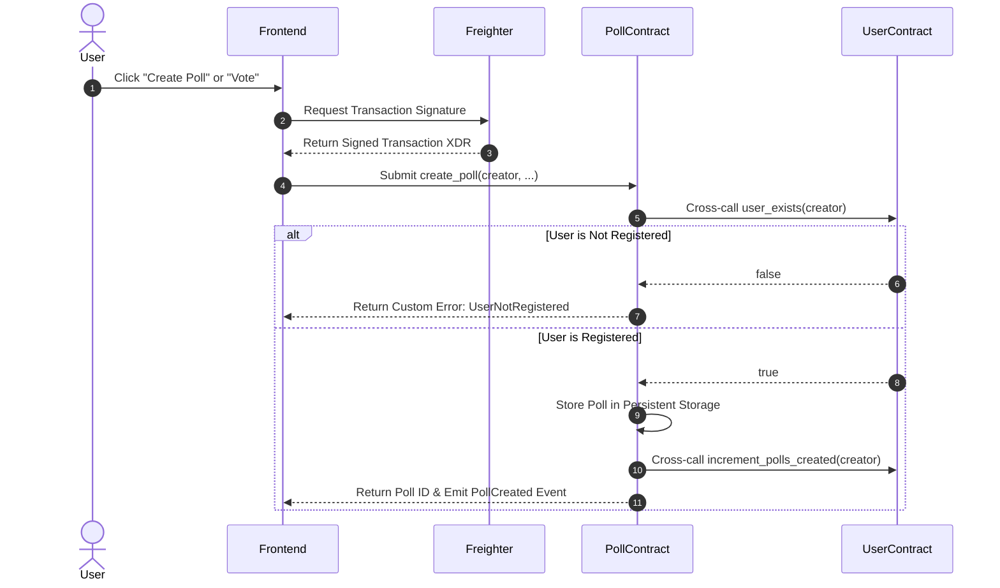

# NovaPoll Architecture & System Design Document

This document outlines the technical design, storage layouts, data flows, and inter-contract cross-calling mechanisms for the NovaPoll decentralized polling platform on Stellar Soroban.

---

## 🏛️ High-Level Component Topology

NovaPoll comprises three primary layers:

1. **Soroban Smart Contract Layer (Rust)**:
   - `UserContract`: Manages user profile registration, updates, and profile statistics (`polls_created`, `votes_cast`).
   - `PollContract`: Manages poll creation, option tracking, voting lock enforcement, winner calculations, and inter-contract user validation.

2. **Blockchain RPC & Event Streaming Layer**:
   - `Stellar Soroban Testnet RPC`: Handles pre-flight transaction simulation, transaction submission, and state queries.
   - `Soroban Event Listener`: Polls RPC event topics (`(symbol_short!("poll"), symbol_short!("vote"))`) to stream live updates to the frontend.

3. **User-Facing Presentation Layer (React + TypeScript)**:
   - Responsive dark-theme dashboard with Glassmorphic UI elements and Aurora ambient animations.
   - Integrated `@stellar/freighter-api` for client-side cryptographic transaction signing.

---

## 🔗 Inter-Contract Communication Flow

---

## 💾 Soroban Storage Schemas

### User Contract Storage (`contracts/user`)
- **Key**: `UserDataKey::User(Address)` (Persistent Storage)
- **Value Struct**: `UserProfile`
  - `wallet_address: Address`
  - `username: String`
  - `bio: String`
  - `profile_image_url: String`
  - `joined_at: u64`
  - `polls_created: u32`
  - `votes_cast: u32`

### Poll Contract Storage (`contracts/poll`)
- **Key**: `PollDataKey::Poll(u32)` (Persistent Storage)
- **Value Struct**: `Poll`
  - `poll_id: u32`
  - `creator: Address`
  - `title: String`
  - `description: String`
  - `category: u32`
  - `options: Vec<String>`
  - `vote_counts: Vec<u32>`
  - `total_votes: u32`
  - `status: u32` (0 = Active, 1 = Closed)
  - `created_at: u64`
  - `end_time: u64`
  - `winner: u32`

- **Key**: `PollDataKey::Voted(u32, Address)` (Persistent Storage)
- **Value**: `bool` (Guarantees 1 vote per wallet per poll)
